# 🚀 AI Resume Builder – Project Blueprint

## 🎯 Website Workflow Overview

### Landing Page
- **Animated sections** explaining features with GSAP + ScrollTrigger
- **Navigation bar**: Login, Signup, ATS Checker, Build Resume, My Resumes
- **Hero section** with call-to-action for AI-powered resume building

### Authentication Flow
1. **OAuth Login** via Google, GitHub, LinkedIn
2. **LinkedIn Integration**: Pulls basic info (name, current role, experience, skills)
3. **Manual Entry**: Users can enter details manually if not using LinkedIn

### AI-Powered Resume Builder Workflow
1. **Job Description Input**: User pastes job description
2. **AI Question Generation**: System sends job description + user profile to Gemini AI
3. **Dynamic Questionnaire**: Frontend displays AI-generated questions
4. **User Input**: User fills out answers
5. **LaTeX Generation**: All data sent to Gemini for LaTeX resume code
6. **PDF Compilation**: Backend compiles LaTeX → PDF
7. **Preview & Download**: User sees PDF preview with download option

### Cover Letter Generation
- User proceeds to Cover Letter page
- System sends job description + resume details + preferred tone to Gemini
- Gemini returns LaTeX code for cover letter
- Compile & show cover letter PDF preview

### ATS Checker
- Analyze job description vs final resume text
- Show keyword match percentage, missing keywords, improvement suggestions

## 🛠️ Tech Stack Implementation

### Frontend
- ✅ **Next.js 15** with App Router
- ✅ **React 19** with TypeScript
- ✅ **Tailwind CSS** for styling
- ✅ **GSAP + ScrollTrigger** for animations
- ✅ **Framer Motion** for component animations
- ✅ **Lucide React** for icons

### Backend
- ✅ **Next.js API Routes** for backend functionality
- ✅ **OAuth integration** (Google, GitHub, LinkedIn) via NextAuth.js
- ✅ **LaTeX compilation** using node-latex and pdflatex
- ✅ **MongoDB** with Mongoose for data storage

### AI Integration
- ✅ **Gemini API** for structured JSON prompts & responses
- ✅ **Structured prompting** for consistent AI outputs
- ✅ **Fallback mechanisms** for AI failures

## 📄 Frontend Pages & Features

### 1. Landing Page (`/`)
- Hero animation with GSAP
- Scroll-triggered features display
- Call-to-action buttons
- Testimonials section

### 2. Authentication Pages
- **Sign In** (`/auth/signin`): OAuth + email/password
- **Sign Up** (`/auth/signup`): Registration with OAuth options

### 3. AI Resume Builder (`/build-resume-ai`)
- **Step 1**: Job description input
- **Step 2**: AI-generated questions
- **Step 3**: PDF preview and download

### 4. Manual Resume Builder (`/build-resume`)
- Multi-section form builder
- Template selection
- Real-time preview

### 5. ATS Checker (`/ats-checker`)
- Resume upload (drag & drop)
- Job description input
- ATS analysis report

### 6. My Resumes (`/my-resumes`)
- Resume management dashboard
- Search and filter functionality
- Download and share options

## 🔗 System Data Flow

```mermaid
graph TD
    A[User Input Job Description] --> B[Gemini AI → JSON Questions]
    B --> C[User Answers Questions]
    C --> D[Gemini AI → LaTeX Code]
    D --> E[LaTeX Compiler → PDF]
    E --> F[PDF Preview & Download]
    F --> G[Cover Letter Generation]
    G --> H[ATS Analysis]
    H --> I[Profile Update & Storage]
```



## 🤖 AI Integration Details

### Gemini API Prompts

#### 1. Question Generation Prompt
```typescript
const prompt = `
You are an expert resume writer and career coach. Analyze the following user profile and job description to generate relevant questions that will help create a targeted resume.

User Profile:
- Name: ${userProfile.name}
- Title: ${userProfile.title || 'Not specified'}
- Skills: ${userProfile.skills.join(', ')}
- Experience: ${userProfile.experience.length} positions
- Education: ${userProfile.education.length} degrees

Job Description:
- Title: ${jobDescription.title}
- Company: ${jobDescription.company}
- Requirements: ${jobDescription.requirements.join(', ')}
- Responsibilities: ${jobDescription.responsibilities.join(', ')}

Generate 5-8 questions to collect missing information that would be relevant for this specific job application. Focus on:
1. Quantifiable achievements
2. Specific technical skills
3. Relevant projects
4. Industry-specific experience
5. Certifications or training

Return ONLY a valid JSON array with this exact structure:
[
  {
    "question": "Describe a major achievement in your current role that demonstrates leadership.",
    "input_type": "textarea",
    "required": true,
    "category": "achievements"
  }
]
`;
```

#### 2. LaTeX Resume Generation Prompt
```typescript
const prompt = `
You are an expert LaTeX resume writer. Generate professional LaTeX code for a resume based on the following information.

User Profile:
${JSON.stringify(userProfile, null, 2)}

Job Description:
${JSON.stringify(jobDescription, null, 2)}

Additional Answers:
${JSON.stringify(additionalAnswers, null, 2)}

Template Style: ${template}

Requirements:
1. Create a professional, ATS-friendly resume
2. Use the ${template} template style
3. Tailor content to the job description
4. Include quantifiable achievements
5. Use action verbs and industry-specific keywords
6. Ensure proper LaTeX syntax
7. Return ONLY the LaTeX code, no explanations

Return the complete LaTeX document code:
`;
```

#### 3. ATS Analysis Prompt
```typescript
const prompt = `
Analyze the following resume against the job description for ATS (Applicant Tracking System) compatibility.

Resume Text:
${resumeText}

Job Description:
${JSON.stringify(jobDescription, null, 2)}

Provide analysis in JSON format:
{
  "score": 85,
  "keywords": ["JavaScript", "React", "Node.js"],
  "missingKeywords": ["TypeScript", "Docker"],
  "suggestions": [
    "Add more quantifiable achievements",
    "Include specific technical skills"
  ]
}

Score should be 0-100 based on keyword match and content relevance.
`;
```

## 🗄️ Database Schema

### User Model (MongoDB)
```typescript
interface IUser extends Document {
  // Authentication
  email: string;
  name: string;
  image?: string;
  emailVerified?: Date;
  accounts: OAuthAccount[];
  
  // Personal Information
  personalInfo: {
    firstName: string;
    lastName: string;
    title?: string;
    summary: string;
    contactInfo: ContactInfo;
    dateOfBirth?: Date;
    nationality?: string;
    availability?: string;
    salary?: SalaryRange;
  };
  
  // Professional Information
  workExperience: WorkExperience[];
  education: Education[];
  skills: Skill[];
  projects: Project[];
  certifications: Certification[];
  languages: Language[];
  awards: Award[];
  publications: Publication[];
  volunteerExperience: VolunteerExperience[];
  interests: Interest[];
  references: Reference[];
  
  // Resume Management
  resumes: Resume[];
  
  // Settings & Preferences
  preferences: UserPreferences;
  
  // Analytics & Usage
  analytics: UserAnalytics;
  
  // Timestamps
  createdAt: Date;
  updatedAt: Date;
}
```

## 🔧 API Endpoints

### AI Endpoints
- `POST /api/ai/generate-questions` - Generate AI questions
- `POST /api/ai/generate-resume` - Generate LaTeX resume
- `POST /api/ai/generate-cover-letter` - Generate cover letter
- `POST /api/ai/analyze-ats` - Analyze ATS compatibility

### Authentication Endpoints
- `GET/POST /api/auth/[...nextauth]` - NextAuth.js routes
- `POST /api/auth/register` - User registration

### Resume Management
- `GET /api/resumes` - Get user resumes
- `POST /api/resumes` - Create new resume
- `PUT /api/resumes/:id` - Update resume
- `DELETE /api/resumes/:id` - Delete resume

## 🎨 LaTeX Templates

### Template Categories
1. **Modern**: Clean, professional layout with subtle colors
2. **Classic**: Traditional format with clear sections
3. **Creative**: Unique design with visual elements
4. **Minimal**: Simple, clean, and focused

### Template Structure
```latex
\documentclass[11pt,a4paper]{article}
\usepackage[utf8]{inputenc}
\usepackage[T1]{fontenc}
\usepackage{geometry}
\usepackage{fancyhdr}
\usepackage{enumitem}
\usepackage{xcolor}
\usepackage{hyperref}

% Template-specific styling
% ...

\begin{document}
% Header with name and contact info
% Summary section
% Experience section
% Education section
% Skills section
% Projects section (if applicable)
\end{document}
```

## 🔒 Security Features

- **Password hashing** with bcryptjs
- **JWT token authentication** via NextAuth.js
- **OAuth 2.0 integration** for secure third-party login
- **Input validation** and sanitization
- **MongoDB injection protection** via Mongoose
- **Environment variable protection**

## 🚀 Deployment Configuration

### Environment Variables
```env
# Database
MONGODB_URI=mongodb://localhost:27017/resumebuilder

# NextAuth
NEXTAUTH_SECRET=your-nextauth-secret-key-here
NEXTAUTH_URL=http://localhost:3000

# OAuth Providers
GOOGLE_CLIENT_ID=your-google-client-id
GOOGLE_CLIENT_SECRET=your-google-client-secret
GITHUB_ID=your-github-client-id
GITHUB_SECRET=your-github-client-secret
LINKEDIN_CLIENT_ID=your-linkedin-client-id
LINKEDIN_CLIENT_SECRET=your-linkedin-client-secret

# AI Integration
GEMINI_API_KEY=your-gemini-api-key
```

### Production Requirements
- **LaTeX installation** on server (pdflatex)
- **MongoDB Atlas** for database
- **Vercel/Netlify** for hosting
- **AWS S3** for PDF storage (optional)

## 💲 Monetization Strategy

### Freemium Model
- **Free Tier**: 3 resumes/month, basic ATS checks
- **Pro Tier** ($9.99/month): Unlimited resumes, advanced ATS insights
- **Enterprise Tier** ($29.99/month): Team collaboration, custom templates

### Premium Features
- Advanced ATS scoring algorithms
- Custom LaTeX templates
- Resume sharing and collaboration
- Priority support
- API access for integrations

## 🔮 Future Enhancements

### Phase 2 Features
- **Auto-apply bot** for job portals
- **AI-based resume feedback** (recruiter simulation)
- **Chrome extension** for job posting scraping
- **Interview question simulator**

### Phase 3 Features
- **Resume version control** and history
- **Multi-language support**
- **Mobile app development**
- **Advanced analytics dashboard**

### Technical Improvements
- **LLaMA 3 integration** via Ollama/OpenRouter
- **Real-time collaboration** features
- **Advanced PDF customization** options
- **Integration with job boards** (Indeed, LinkedIn, etc.)

## 📊 Performance Optimization

### Frontend
- **Code splitting** with Next.js dynamic imports
- **Image optimization** with Next.js Image component
- **Lazy loading** for non-critical components
- **Service worker** for offline functionality

### Backend
- **Database indexing** for fast queries
- **Caching** with Redis (optional)
- **CDN** for static assets
- **Rate limiting** for API endpoints

### AI Integration
- **Request caching** for similar prompts
- **Fallback mechanisms** for AI failures
- **Async processing** for long-running tasks
- **Queue system** for high-volume requests

## 🧪 Testing Strategy

### Unit Tests
- **Jest** for component testing
- **React Testing Library** for user interactions
- **API route testing** with supertest

### Integration Tests
- **End-to-end testing** with Playwright
- **Database integration** testing
- **OAuth flow** testing

### Performance Tests
- **Lighthouse** for web vitals
- **Load testing** for API endpoints
- **PDF generation** performance testing

## 📈 Analytics & Monitoring

### User Analytics
- **Resume creation** metrics
- **Template usage** statistics
- **ATS score** improvements
- **User retention** analysis

### Technical Monitoring
- **Error tracking** with Sentry
- **Performance monitoring** with Vercel Analytics
- **API usage** metrics
- **AI response** quality monitoring

---

This blueprint provides a comprehensive foundation for building a production-ready AI-powered resume builder. The implementation follows modern web development best practices and is designed for scalability and maintainability. 